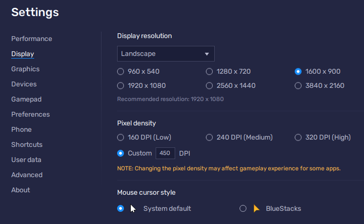
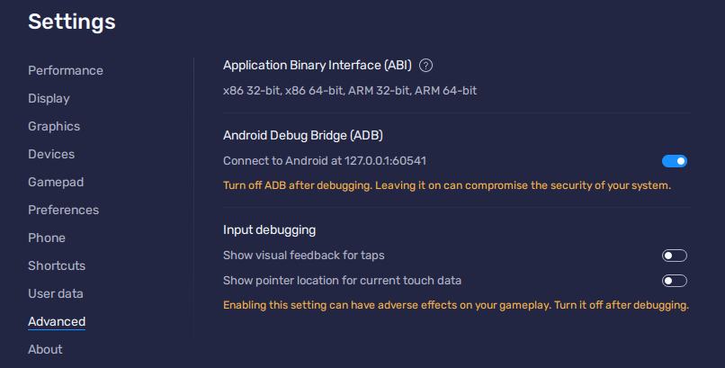

# RokTracker

Open Source Rise of Kingdoms Stats Management Tool. Track TOP (1-995) Players in Power/KillPoints. Creates a .xlsx file with Governor Id, Power, Kill Points, T1/T2/T3/T4/T5 Kills, Total kills, T4+T5 kills, Dead troops, RSS Assistance, Helps and Alliance.

This is a heavily modified version of the original tool from [nikolakis1919](https://github.com/nikolakis1919) in the repository [https://github.com/nikolakis1919/RokTracker](https://github.com/nikolakis1919/RokTracker)

# Required

1. Bluestacks 5 Installation [https://www.bluestacks.com/de/bluestacks-5.html](https://www.bluestacks.com/de/bluestacks-5.html)
2. Python 3.11.0 Installation [https://www.python.org/downloads/release/python-3110/](https://www.python.org/downloads/release/python-3110/)
3. Tesseract-OCR Installation [https://digi.bib.uni-mannheim.de/tesseract/tesseract-ocr-w64-setup-v5.0.0.20211201.exe](https://digi.bib.uni-mannheim.de/tesseract/tesseract-ocr-w64-setup-v5.0.0.20211201.exe)
4. Adb Platform Tools Download and Extract(See Important Notes) [https://dl.google.com/android/repository/platform-tools_r31.0.3-windows.zip](https://dl.google.com/android/repository/platform-tools_r31.0.3-windows.zip)
5. On Windows "Microsoft Build Tools für C++" might be required for some of the python packages [https://visualstudio.microsoft.com/de/visual-cpp-build-tools/](https://visualstudio.microsoft.com/de/visual-cpp-build-tools/)
6. Windows 10-Tested, Windows 7 or Windows 11 could be fine.

# Bluestacks 5 Settings





Everything (maybe not the performance, adjust that to your PC) should be like this. The scanner script tries to find the current debugging port by reading the bluestacks config. For that to work the emulator used for scanning should have the instance name "RoK Tracker" and you need to change the config location in the scanner.py file to match your Bluestacks installation. If the auto detect fails it will default to 5555 and you can input the actual port to overwrite it.

# Important Notes

1. It is recommended to use a venv to keep your global python installation clean of the dependencies. After setting up the venv and activating it, you can install the requirements with the requirements.txt file (more about that in the "Usage"" section)

2. You must run the .ps1 file without administration privileges.

3. Make sure the tesseract executable is on the PATH variable of your machine

4. Platform tools folder should be extracted as a folder inside the Tracker's folder. Like the following image

   

5. In order to get only your kingdoms ranks, the character that is currently logged in game must be in HOME KINGDOM, else you will get all the players in your KvK including players from different kingdoms.

6. Game Language should be English. Anything else will cause trouble in detecting inactive governors. Change it only for scan, if yours is different and then switch back.

7. The view before running the programme should be at the top of power rankings or at the top of kill points rankings. No move should be made in this window until scanning is done.

8. Account must be lower in ranks than the amount of players you want to scan. e.g. Cannot scan top 100 when character's rank is 85. Use a farm account instead.

9. You can see tool's progress in CMD when it's running.

10. Chinese letters might not be shown properly in CMD but they are visible in the final .xlsx file.

11. Bluestacks settings must be the same as in pictures above. THIS IS VERY IMPORTANT!

12. You can do whatever you want in your computer when tool is scanning.

13. Resume Scan option starts scanning the middle governor that is displayed in screen. The 4th in order. So before starting the tool make sure that you are in the correct view in bluestacks.

14. BE CAREFUL to always copy the .xlsx file from the RokTracker folder when it is created, because in the next capture, there is a chance to overwrite.

# Usage

This script runs completely in the command line. When you run it, it will ask all the important inputs and then start scanning until it is finished. You can always stop the scan by pressing CRTL+C and confirming. (But it might happen that doing so will case tesseract to go on a rampage, to be sure be prepared to kill the python process in another command line window)

There are two ways of starting the script. First option is to simply run the powershell script. That script automatically creates and loads a venv in the venv folder, installs all dependencies and starts the actual scanner script (Make sure to have your python 3.11 selected as default version by checking the output of `python --version`):

```powershell
.\rok-scanner.ps1
```

The other way is to manually do all that:

```powershell
python -m venv ./venv
.\venv\Scripts\Activate.ps1
pip install -r requirements.txt
python rok-scanner.py
```

Options on startup:


Single result in cmd:


Results in excel file.

